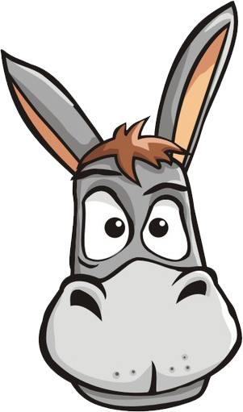
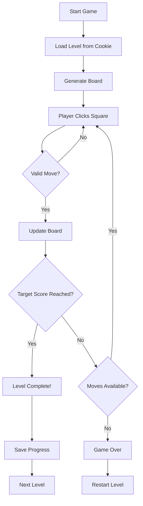

<div align="center">

# 🐴 BuJim

### *Help Jod the Sicilian Donkey Collect All the Hay!*

[](game.html)
[](gameEngine.js)
[](index.html)
[](style.css)



---

</div>

## 🎯 About

**BuJim** is an addictive puzzle game where you guide **Jod**, a charming Sicilian donkey, across a grid to collect hay. With unique movement rules and progressively challenging levels, this game will test your strategic thinking and planning skills!

### 🌟 Features

- 🎮 **10 Progressive Levels** - Each level increases in difficulty with larger grids
- 🎵 **Immersive Audio** - Background music, jump sounds, victory & defeat themes
- 📱 **Mobile-Friendly** - Fully responsive design that works on all devices
- 🎨 **Beautiful UI** - Modern glassmorphism design with smooth animations
- 💾 **Progress Saving** - Your level progress is automatically saved
- ⚙️ **Audio Controls** - Customize music and sound effects volume

---

## 🕹️ How to Play

### Movement Rules

Jod can move in a **unique pattern**:
- **2 squares** horizontally or vertically
- **1 square** diagonally

Think of it as a modified knight's move from chess!

### Objective

1. **Choose** where to place Jod on the grid
2. **Jump** from square to square collecting hay
3. **Reach** the target score to advance to the next level
4. **Avoid** getting stuck with no valid moves!

### Controls

- **Click/Tap** on any square to place Jod or make him jump
- **Settings Button** (⚙️) to control audio
- **Restart Level** to try again
- **Reset Progress** to start from Level 1

---

## 🏗️ Project Structure

```
bujim/
├── index.html              # Landing page with instructions
├── game.html               # Main game interface
├── style.css               # Modern styling with CSS variables
├── gameEngine.js           # Core game logic
├── levelCalculator.js      # Level progression & cookie management
├── README.md               # You are here! 📍
└── assets/
    ├── don.png             # Jod the donkey sprite
    ├── hay.png             # Hay stack image
    ├── jodmoves.png        # Movement tutorial
    ├── farm.jpg            # Background image
    ├── backMus.mp3         # Background music
    ├── jump.mp3            # Jump sound effect
    ├── victory.mp3         # Victory sound
    └── lost.mp3            # Game over sound
```

---

## 🧩 Technical Architecture

### `gameEngine.js` - Core Functions

| Function | Purpose |
|----------|---------|
| `startBoard(M, N, WinningScore)` | Initializes the game board for each level with dimensions M×N |
| `nextMove(clickLocation)` | Handles player clicks, validates moves, and updates the UI |
| `allowed(x, y)` | Validates if a move to coordinates (x,y) is legal |
| `checkChance(x, y)` | Counts available moves and determines win/loss conditions |
| `checkValues(val)` | Boundary validation for move calculations |

### `levelCalculator.js` - Progression System

| Function | Purpose |
|----------|---------|
| **Cookie Handling** | Tracks player progress using localStorage |
| `reset()` | Resets game progress after completing all levels |
| `viewData()` | Development utility for debugging cookie state |
| **Level Switch** | Dynamically calls `startBoard()` based on current level |

### Game Flow



---

## 🚀 Getting Started

### Quick Start

1. **Clone or download** this repository
2. **Open** `index.html` in your browser
3. **Read** the instructions
4. **Click** "Play Now!"
5. **Enjoy!** 🎉

### No Build Required!

This is a pure **vanilla JavaScript** game with zero dependencies. Just open the HTML files in any modern browser and start playing!

### Browser Compatibility

- ✅ Chrome/Edge (Recommended)
- ✅ Firefox
- ✅ Safari
- ✅ Mobile Browsers

---

## 🎨 Design Philosophy

BuJim features a **modern, premium design** with:

- 🌈 **Vibrant Color Palette** - Warm, inviting colors inspired by Sicilian landscapes
- ✨ **Glassmorphism Effects** - Frosted glass UI elements with backdrop blur
- 🎭 **Smooth Animations** - Donkey jumps with CSS transitions
- 📐 **Responsive Grid** - Adapts to any screen size
- 🎯 **Accessibility** - Clear visual feedback and intuitive controls

---

## 🛠️ Development

### Adding New Levels

Edit the `switch(levelReached)` statement in `levelCalculator.js`:

```javascript
case 11: // New level
    startBoard(7, 7, 30); // 7x7 grid, target score 30
    break;
```

### Customizing Movement Rules

Modify the movement validation in `gameEngine.js` → `allowed(x, y)` function.

### Styling

All visual customization can be done through CSS variables in `style.css`:

```css
:root {
    --primary-color: #your-color;
    --board-size: 400px;
    /* ... more variables */
}
```

---

## 📝 License

This project is open source and available for educational purposes. Feel free to fork, modify, and share!

---

## 🙏 Credits

- **Game Design & Development** - Original BuJim Team
- **Character** - Jod the Sicilian Donkey 🐴
- **Inspiration** - Classic knight's tour puzzle with a twist

---

<div align="center">

### 🌟 Enjoy the Game!

**Made with ❤️ and lots of hay**

[⬆ Back to Top](#-bujim)

</div>
